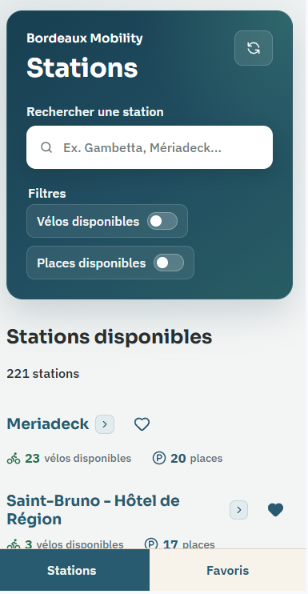
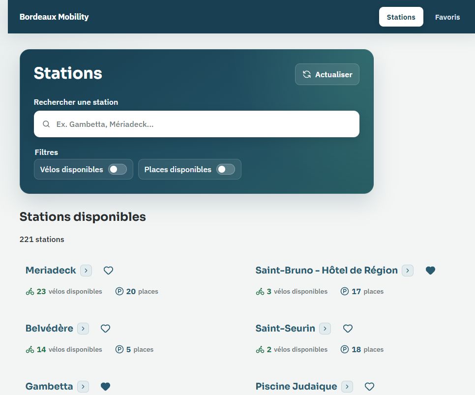

# Bordeaux Mobility

Real-time bike station explorer for Bordeaux Métropole built with Angular and TypeScript.

[Live Demo](https://bordeaux-mobility-m-a.vercel.app/)

---

## Preview

<p align="center">
  
  &nbsp;&nbsp;&nbsp;
  
</p>

---

## About the Project

Angular application using Bordeaux Métropole Open Data to explore bike stations and their real-time availability.
The project focuses on modern Angular practices, RxJS, Signals, Reactive Forms and a mobile-first approach, with layouts progressively adapted for larger screens.

---


## Features

- Real-time bike station availability
- Search and availability filters
- Station details with bike types, status and last update
- Favorite stations persisted with localStorage
- Station address with reverse geocoding
- Direct link to the station location on Google Maps
- Manual data refresh
- Mobile-first responsive interface with dedicated desktop layouts

---

## Built With


---

## Quality

- Unit and component tests with Vitest and Angular TestBed
- ESLint code quality checks
- GitHub Actions CI running lint, tests and production build

---

## Data Sources

Station availability data comes from Bordeaux Métropole Open Data.

Station addresses are resolved from their coordinates using the French national geocoding service provided by the IGN Géoplateforme.

---

## Installation

```bash
git clone https://github.com/m-amroune/bordeaux-mobility.git
cd bordeaux-mobility
npm install
npm start
```

Open `http://localhost:4200`.